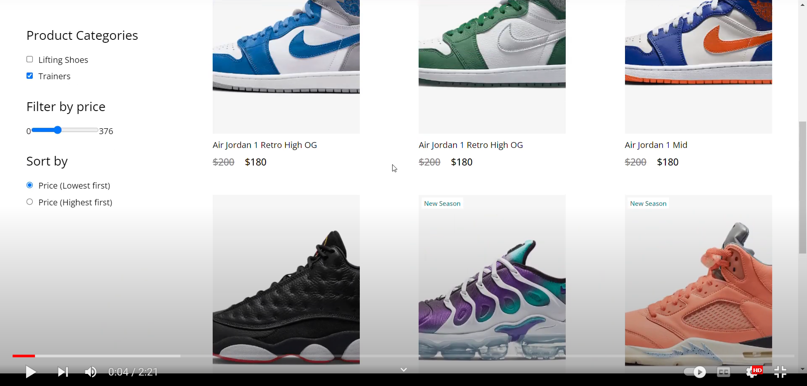

# SneakerHead E-commerce Application
[](https://opensource.org/licenses)

E-commerce application with React for the front-end, mySQL for the backend managed by headless CMS, stripe payments and fictional inventory

### User Story
```
AS a business owner
I WANT to interact with clients on the browser 
SO THAT I can make transations, ship products and allow customers to browse the inventory
```

## Table of Contents

[Installation](#installation)

[Contribution](#contribution)

[Gifs](#gifs)

[Questions](#questions)

----

<a name="installation"></a>
### Installation

For local hosting:

1. `git clone` this repository (for instructions see GitHub docs)
2. type `cd api` into your terminal to change directory
3. type `npm run start` to start the back-end server which populates the inventory
4. type `cd client` in a seperate terminal
5. type `npm run start` in the new terminal
6. navigate to `http://localhost:3000` in your preferred browser to run the app

<a name="contribution"></a>
### Contribution

Single contribution project 

<a name="appDemo"></a>
### App Demo

<a href="https://www.youtube.com/watch?v=R5s3weDsFPE" target="_blank">
  
</a>

----

<a name="questions"></a>
### Questions
##### Contact Me

Feel free to contact me via GitHub or email with any feedback 

[GitHub u/cliffordstevenson](https://github.com/cliffordstevenson)
clifford.andrew.stevenson@gmail.com
